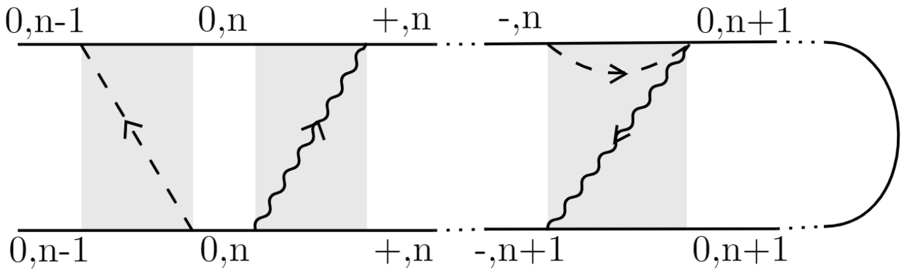

# Single-atom Lasing in a Carbon-nanotube Quantum-dot

## [2019 Jun] Theoretical Physics Research Project (Honours Program)

*Supervisor:* [*Michele Governale*](https://www.victoria.ac.nz/scps/about/staff/michele-governale)  
  
&nbsp;  
We studied the single-atom phonon-lasing effect in a system formed by a mechanical oscillator (carbon-nanotube) interacting with a quantum-dot in contact with two ferromagnetic leads.  
A diagrammatic perturbation expansion approach (with Keldysh formalism) was developed to analyse the case where the leads were non-collinearly polarised.  
  
&nbsp;  
Please click on the following links for more details:  

- [Final Report](/Report-Single-atom_Lasing_in_a_Carbon-nanotube_Quantum-dot.pdf)  
- [Final Presentation](/Talk-Single-atom_Lasing_in_a_Carbon-nanotube_Quantum-dot.pdf)  

&nbsp;  

### [Go back to all projects](https://yileying.github.io/projects/)